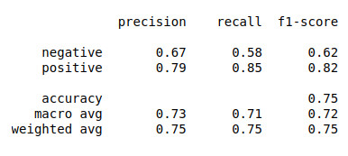

# A simple neural network to classify Amazon product reviews

This project implements a 4 layered neural network using Keras to classify product reviews as positive or negative, using a small dataset retrieved from http://www.cs.uic.edu/~liub/FBS/Reviews-9-products.rar. 
It's designed to satisfy the requirements of one of my NLP courseworks.

## Table of Contents

  * [🗺️ Overview](#%EF%B8%8F-overview)

## 🗺️ Overview

Input data is initially a series of text files, which are cleaned and pre-processed to form sequences of tokens. Sequences of tokens are converted into sequences of integers using a vocabulary mapping. The model takes this input and outputs a single integer (0 = negative, 1 = positive) to classify each input sequence.

## ⚙️ Text cleaning and pre-processing

The product reviews are stored line by line in each text file found in the product_reviews folder. The data is tagged as positive or negative with the [+n] or [-n] tag as shown below:
```
smelling[-1]##Now it will start smelling if you leave it with diapers in it for an extended period but all of them will!
diaper[+2]##We empty ours every day and we have never had an odors from it!
```
The information that is abstracted is the sentence of the review located after the ## tag. Once the information is abstracted, the following lexical processing steps are applied:

  * Lowercasing
  * Removal of stopwords
  * Removal of punctation in between words
  * Removal of non-alphabetic words

Stemming was considered but it had no significant performance boost (further explored in result analysis)

## 👨‍🍳 Data preparation for the model

There are 2090 review samples. The model is analysed using 5-fold CV so roughly 20% of the review samples are used as training data on each fold. The training samples are vectorised using Keras' Tokenizer. The function fit_on_texts() initialises a vocabulary mapping tokens to integers, and texts_to_sequences() is used to vectorise a sequence of tokens into a sequence of integers. As each review varies in length, each sequence of integers is padded with zeroes to standardise the length of each vector.

## 📦 Model 

A simple 4 layer model is implemented in this project.

<p align="center">
  
</p>


  * Embedding Layer: reduces the dimensionality of the input data to improve model efficiency
  * Bidirectional Wrapping of 2 GRUs: provides greater context for the model to work with as it can model relationships between words/phrases in both directions of the input sequences
  * Dense Layer: generates a singular value as an output, activated with a sigmoidal function to classify reviews as positive/negative

## ⏳ Training

The model is trained with the following parameters (but can be adjusted):

  * BATCH_SIZE = 64
  * EPOCHS = 8
  * DIM_SIZE = 16 (size of Embedding and Bidirectional Layers)

## 📊 Results and Analysis

<p align="center">
  
</p>

Here is a confusion matrix representing the mean precision, recall, f1 score and accuracy in 5-fold CV. An average accuracy of 75% is adequate, but I believe it can be improved. The dataset used here is imbalanced - there are 598 more positive reviews than negative reviews. It is clear that the model struggles to classify negative reviews as seen from the relatively low precision, recall and f1 score values.

In order to improve the model, a larger dataset must be used, and preferably a balanced dataset. Currently 2090 reviews is not enough to form a reliable model. I may consider increasing the complexity of the model to learn a larger dataset. Hyperparameter experimentation was conducted in order to find the optimal BATCH_SIZE, EPOCHS and DIM_SIZE values - however this was not exhaustive. In the future, I should use a method such as GridSearchCV to further investigate the tuning of these hyperparameters. 

I also experimented with the use of LSTM layers instead of GRU layers, but that produced no signficant difference and so GRU units were used instead as they are computationally more efficient.
